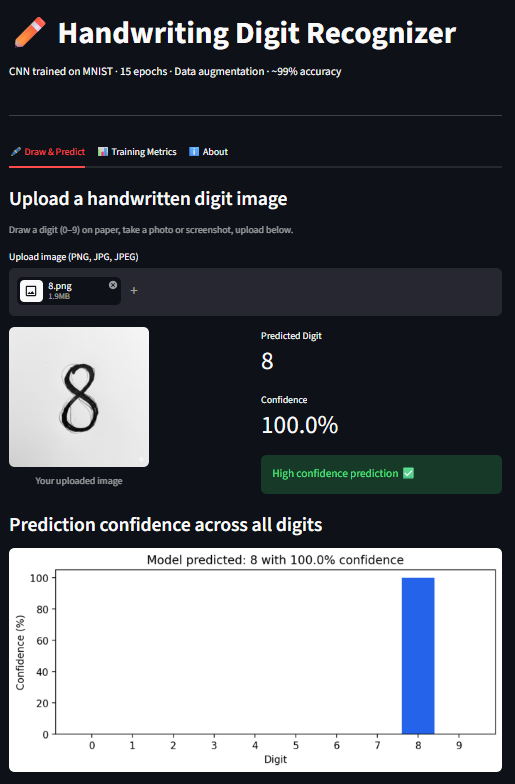
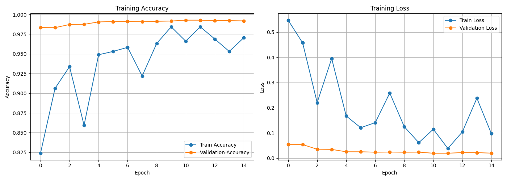

# Handwriting Digit Recognition

### [🚀 Live Demo](https://handwriting-digit-recognition.streamlit.app/)

A CNN trained on MNIST that classifies handwritten digits (0–9) from uploaded photos. Training is done with TensorFlow/Keras; inference is deployed with ONNX Runtime in a Streamlit web app.

**Test set accuracy: 99.19%**

---

## Demo



---

## How it works

1. Upload a photo of a handwritten digit
2. The app preprocesses it — auto-crop, threshold, center — to match MNIST's 28×28 grayscale format
3. The CNN predicts the digit with a confidence score and full probability distribution across all 10 digits

Inference uses an ONNX model, so deployment is lightweight with no TensorFlow dependency at runtime.

---

## Model architecture

```
Input (28×28×1)
→ Conv2D(32)  → MaxPool → Dropout(0.25)
→ Conv2D(64)  → MaxPool → Dropout(0.25)
→ Conv2D(128)           → Dropout(0.25)
→ Dense(256)            → Dropout(0.50)
→ Dense(10, softmax)
```

Trained for 15 epochs with data augmentation (rotation, zoom, shift).

---

## Training results



|          | Train  | Validation |
|----------|--------|------------|
| Accuracy | 97.05% | **99.19%** |
| Loss     | 0.0967 | 0.0196     |

---

## Run locally

```bash
git clone https://github.com/garvranaaa/handwriting-digit-recognition
cd handwriting-digit-recognition

python -m venv .venv
.venv\Scripts\Activate.ps1   # Windows
source .venv/bin/activate     # Mac/Linux

pip install -r requirements.txt
streamlit run app.py
```

The app loads `mnist_model.onnx` for inference. To retrain the model from scratch:

```bash
python train_model.py
```

---

## Stack

| Stage | Libraries |
|-------|-----------|
| Training | TensorFlow, Keras |
| Inference | ONNX Runtime |
| App | Streamlit, NumPy, Pillow, Matplotlib |

---

Garv Rana · EE Undergrad · [DTU](https://dtu.ac.in) · [GitHub](https://github.com/garvranaaa) · [LinkedIn](https://linkedin.com/in/garvsanjeevrana)
